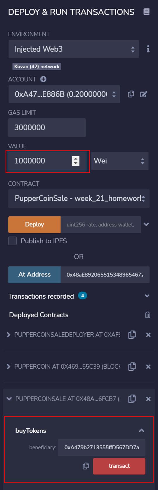

# Week 21 Homework
## Crowdsale
I created smart contracts to crowdsale a ERC20 token, PupperCoin to help fund the network development. The goal is to raise 300 ETH in 24 weeks.

To perfom this crowdsale, three contracts were created.
- PupperCoin
- PupperCoinSale
- PupperCoinSaleDeployer

### PupperCoin
This contract creates ECR20Mintable token, PupperCoin.  I imported ERC20Mintable and ERC20Detailed contracts from OpenZeppelin library.

### PupperCoinSale
This contract performs a crowdsale.  We use the following contracts from OpenZeppelin library.
- Crowdsale
- MintedCrowdsale
- CappedCrowdsale
- TimeCrowdsale
- RefundablePostDeliveryCrowdsale

### PupperCoinDeployer

This contact is to deploy PupperCoin and PupperCoinSale contracts.

## Test 
For testing purpose I modified the parameters as follows;
Goal: 300 ETH to 3000000 Wei
Duration: 24 weeks to 60 minutes

### Deployment

Deploy PupperCoinSaleDeployer.

PupperCoinSaleDeployer was successfuly deployed.

Deploy PupperCoin.

PupperCoin is deployed.

Deploy PupperCoinSale.

PupperCoinSale is deployed.

Check parameters.

### Transactions

The first investor invests 1000000 Wei.

The transction was successful.

Check how much Wei has been raised.

The second investor invests 1000000 Wei.

The transction was successful.

Check how much Wei has been raised.

The third investor invests 1000000 Wei.

The transction was successful.

Check how much Wei has been raised. Yes, we have acheived the goal!

The cap has also been reached. But someone tries to buy PupeerCoin.

Error message pops up.

60 minutes has been passed... Let's finalize.

Successfully finalized!

Let's see if the parmeters have changed.

Lets's check token balance for each investor.

### Adding PupperCoin to Metamask

Let's export PUP token to Metamask.
Click "Assets" tab and navigate to "Import tokens."

Populate "Token Contact Address" with PupperCoin contract address.  Symbol and decimal automatically show up. Then click "Add Custom Token."

You see PupperCoin and its balance. Click "Import Tokens."

